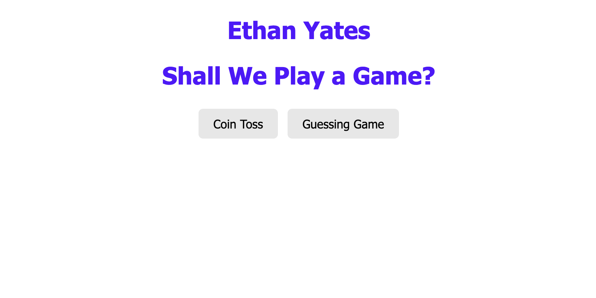

# Two Games (Final Project)

This repository contains my final project for my SDEV 2110 course.

## List of Games

- **Coin Toss**
- **Guessing Game** *(aka Number Guess)*

## Page Preview



## donut.c

This assignment requires me to add a code block and a hyperlink, I have no idea what else to add so I'm putting some C code that shows a spinning donut when compiled and ran.

```
             k;double sin()
         ,cos();main(){float A=
       0,B=0,i,j,z[1760];char b[
     1760];printf("\x1b[2J");for(;;
  ){memset(b,32,1760);memset(z,0,7040)
  ;for(j=0;6.28>j;j+=0.07)for(i=0;6.28
 >i;i+=0.02){float c=sin(i),d=cos(j),e=
 sin(A),f=sin(j),g=cos(A),h=d+2,D=1/(c*
 h*e+f*g+5),l=cos      (i),m=cos(B),n=s\
in(B),t=c*h*g-f*        e;int x=40+30*D*
(l*h*m-t*n),y=            12+15*D*(l*h*n
+t*m),o=x+80*y,          N=8*((f*e-c*d*g
 )*m-c*d*e-f*g-l        *d*n);if(22>y&&
 y>0&&x>0&&80>x&&D>z[o]){z[o]=D;;;b[o]=
 ".,-~:;=!*#$@"[N>0?N:0];}}/*#****!!-*/
  printf("\x1b[H");for(k=0;1761>k;k++)
   putchar(k%80?b[k]:10);A+=0.04;B+=
     0.02;}}/*****####*******!!=;:~
       ~::==!!!**********!!!==::-
         .,~~;;;========;;;:~-.
             ..,--------,*/
```

[Here is a link to how donut.c works](https://www.a1k0n.net/2011/07/20/donut-math.html)